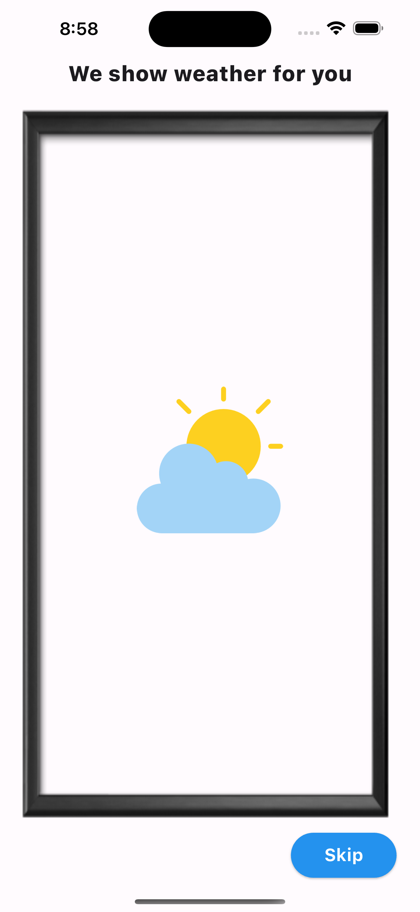
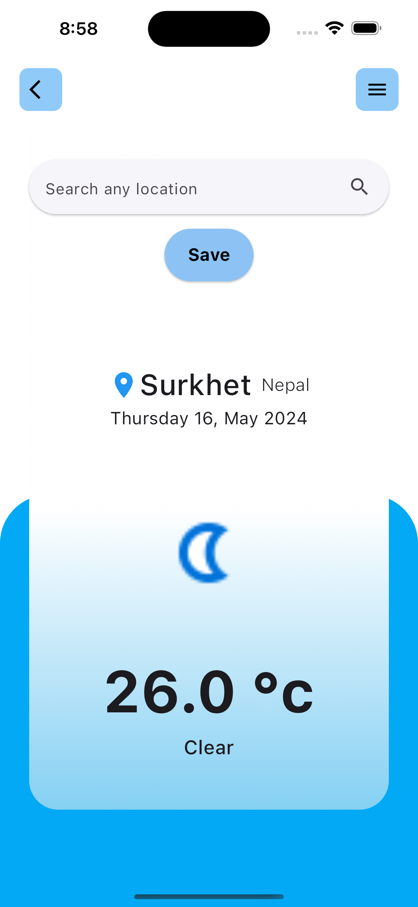
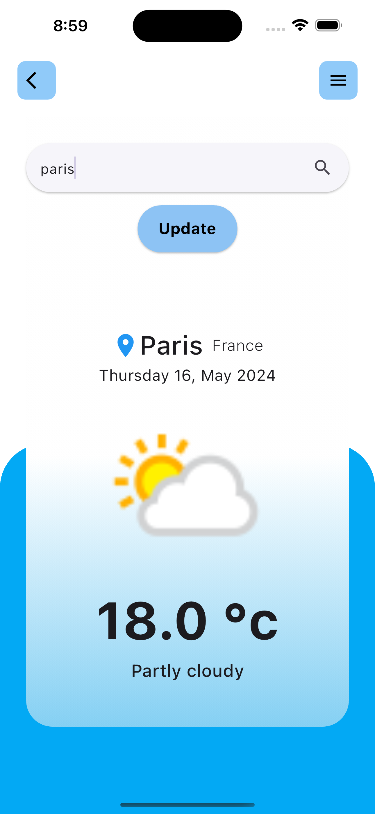

# weather_app

This is a simple weather app built with Flutter. It shows the current weather information for a location. Users can search for a location and get its weather details.

## Screenshot

 help screen     home page screen    home page screen 

### App Description:

- **Splash Screen:**
  - The app displays a splash screen on launch.
  - Users can skip the splash screen or it automatically navigates to the next screen after 5 seconds.
  

- **Home Screen:**
  
- **Location Permission:**
  - If the user opens the app for the first time, it asks for location permission.
  - Permission is managed using the `permission_handler` package.

- **Current Location Weather:**
  - The app displays the current weather information based on the user's location.
  - It uses the `geolocator` package to get the device's location.

- **Search Weather by Location:**
  - Users can search for weather information for any location.
  - Searched locations are stored using shared preferences, so the app remembers the last searched location.
